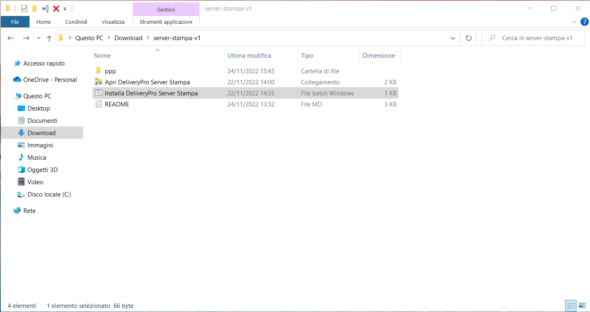
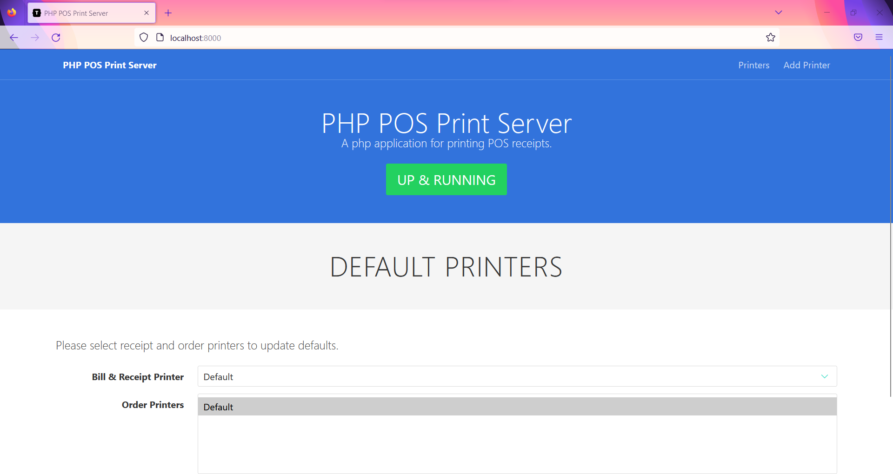
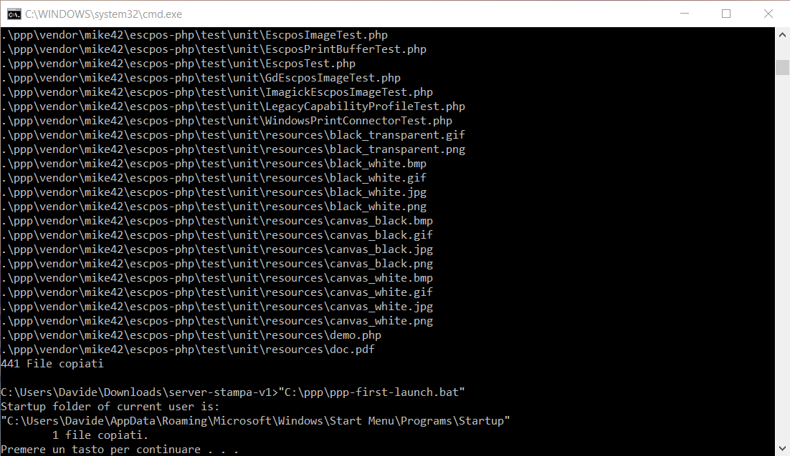

# Guida a DeliveryPro Server Stampa

## Installazione del server locale di stampa
1. Scarica lo zip con tutti i files necessari da [questo link](https://github.com/so-spe/server-stampa/releases) ed estrai il suo contenuto.

2. Fai doppio clic sul file `Installa DeliveryPro Server Stampa`.

3. Se l'installazione è andata a buon fine, si apre una scheda del browser che mostra il server in esecuzione.

**N.B.:** una finestra simile a quella nell'immagine sottostante rimane aperta per permetterti di controllare il risultato dell'installazione (premi un tasto qualsiasi per chiuderla).

## Utilizzo dell'applicazione web
Usa il file `Apri DeliveryPro Server Stampa` oppure clicca su [questo link](http://localhost:8000) per aprire l'applicazione web.

- Clicca su `Printers` se vuoi vedere le stampanti salvate o se vuoi testare il funzionamento di una stampante (facendo clic sull'icona della stampante verrà stampata una comanda di prova).

- Clicca su `Add Printer` per aggiungere i dati della tua stampante (gli stessi dati dovranno poi essere inseriti anche nelle [impostazioni stampante](https://www.deliverypro.cloud/#/settings-printers) su DeliveryPro).

**N.B.:** per il corretto funzionamento dell'applicazione web deve essere presente almeno una stampante salvata, perciò ti consigliamo di inserire sempre una nuova stampante prima di cancellarne una (in linea di massima ti basta creare una nuova stampante usando i dati della stampante di default già presente prestando attenzione a cambiare l'indirizzo IP).

## Risoluzione dei problemi
- Alcuni software anti-virus potrebbero spostare in quarantena determinati files necessari per la corretta esecuzione del server. Se ciò accade apri la sezione quarantena del tuo anti-virus e ripristina i files rilevati come minaccia prestando attenzione ad aggiungere l'eccezione.
- All'avvio del tuo computer potresti veder apparire e scomparire una finestra: vuol dire semplicemente che il server si sta avviando.
- Se riscontri dei malfunzionamenti, nella maggior parte dei casi puoi risolvere ripetendo l'installazione.

## Supporto
Per ricevere supporto tecnico apri una [issue](https://github.com/so-spe/server-stampa/issues) descrivendo il tuo problema, ti risponderemo il prima possibile.
